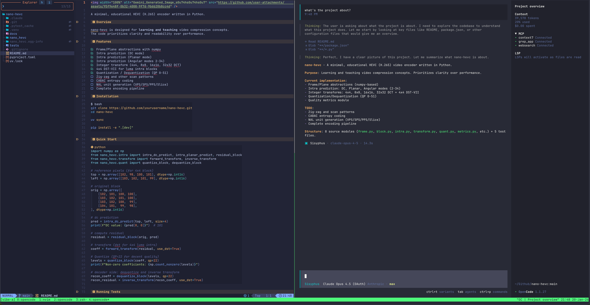

# LazyVim Configuration

My personal LazyVim configuration.



## Prerequisites

### Install Neovim (>= 0.9.0)

**macOS**:
```bash
brew install neovim
```

**Linux**:
```bash
# Ubuntu/Debian
sudo add-apt-repository ppa:neovim-ppa/unstable
sudo apt update
sudo apt install neovim

# Arch
sudo pacman -S neovim
```

### Install Dependencies

**macOS**:
```bash
brew install git ripgrep fd lazygit node python3
pip3 install pynvim
npm install -g neovim
```

**Linux**:
```bash
sudo apt install git ripgrep fd-find nodejs npm python3-pip
pip3 install pynvim
npm install -g neovim
# lazygit - https://github.com/jesseduffield/lazygit#installation
```

## Installation

```bash
# Backup existing config (if any)
mv ~/.config/nvim ~/.config/nvim.bak
mv ~/.local/share/nvim ~/.local/share/nvim.bak
mv ~/.local/state/nvim ~/.local/state/nvim.bak
mv ~/.cache/nvim ~/.cache/nvim.bak

# Clone this config
git clone https://github.com/Luodian/lazyvim.git ~/.config/nvim

# Start Neovim - plugins will auto-install
nvim
```

## Update

```bash
cd ~/.config/nvim && git pull
```

## References

- [LazyVim](https://lazyvim.github.io/)
- [Neovim](https://neovim.io/doc/)
